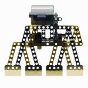
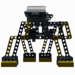
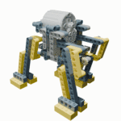

# LegoTechnicSimulation

Physical simulation of Lego Technic builds.

<p align="center">
  
  
  
</p>

## What this repository does

This project parses LDraw (`.ldr`) models of Lego Technic builds, analyses
their mechanical structure, and generates animations via two backends:

- **Blender** – high-quality rendered animations using armature IK for
  kinematic linkages and driver expressions for gear trains.
- **MuJoCo** – physics-based simulation with closed kinematic loop support,
  enabling walking robots to move under motor power.

The pipeline:

1. **Parse** – reads an `.ldr` file and resolves all sub-part references from a
   local LDraw parts library.
2. **Build rigid units** – groups parts connected by friction pins, axles in
   axle holes, and other rigid connectors into single rigid bodies.
3. **Detect joints** – identifies revolute (hinge) joints where frictionless
   pins or axles in round holes connect two units.
4. **Detect motors** – recognises Technic motors (e.g. 58121.dat) and marks
   their output shafts as driven revolute joints.
5. **Detect gear meshes** – finds parallel and bevel gear pairs at correct
   centre distances and computes gear ratios.
6. **Build drive train** – traces the gear chain from the motor outward via BFS.
7. **Generate output** – either a Blender Python script or MuJoCo MJCF XML.

### Output modes

| Flag | Description |
|------|-------------|
| *(default)* | Static Blender scene with rigid bodies and constraints |
| `--assembly` | Units appear one by one in an animated assembly sequence |
| `--drivetrain` | Gears spin in sequence from motor outward |
| `--simulate` | Kinematic linkage animation (IK armature) with gear drivers |
| `--mujoco` | MuJoCo MJCF export with physics simulation |

## Prerequisites

- Python 3.10+
- An LDraw parts library on disk (auto-detected or specified via `--ldraw-library`)
- [Blender](https://www.blender.org/) 4.1+ for running the generated scripts
- [MuJoCo](https://mujoco.org/) (`pip install mujoco`) for physics simulation

## Quick start

```bash
git clone https://github.com/yoff/LegoTechnicSimulation.git
cd LegoTechnicSimulation
python -m venv .venv && source .venv/bin/activate
pip install -r requirements.txt && pip install -e .
```

Download the LDraw library and (optionally) Blender:

```bash
python setup_env.py --ldraw-dir /opt/ldraw
python setup_env.py --blender-dir ~/apps/blender   # optional
```

Download a sample model:

```bash
mkdir -p sample_models/Walker1
curl -L https://yoff.github.io/lego-walker/Walker1/Walker1.ldr \
     -o sample_models/Walker1/Walker1.ldr
```

## Usage

### Kinematic simulation (Blender)

The `--simulate` mode uses armature IK to animate closed kinematic linkages
(4-bar mechanisms, walking legs) with precise gear-driven crank rotation:

```bash
lego-technic-sim sample_models/Walker1/Walker1.ldr \
                 /tmp/walker1_sim.py \
                 --simulate --anchor-motor --fast
blender --background --python /tmp/walker1_sim.py
```

Add `--anchor-motor` to pin the chassis (shows leg motion clearly), or omit it
for a free chassis that rests on the ground plane.

### Physics simulation (MuJoCo)

The `--mujoco` mode exports an MJCF XML with real mesh geometry. MuJoCo solves
closed kinematic loops via equality constraints, enabling physics-driven
walking:

```bash
lego-technic-sim sample_models/Walker1/Walker1.ldr \
                 /tmp/walker1.xml \
                 --mujoco --mujoco-duration 5
```

This writes the MJCF XML plus per-unit STL mesh files, then runs a simulation
and records the trajectory. Render with MuJoCo's viewer or the offscreen
renderer.

### Assembly animation

```bash
lego-technic-sim sample_models/Walker1/Walker1.ldr \
                 /tmp/walker1_assembly.py \
                 --assembly --frames-per-unit 10
```

### Drive train animation

```bash
lego-technic-sim sample_models/Walker1/Walker1.ldr \
                 /tmp/walker1_drivetrain.py \
                 --drivetrain
```

### Fast rendering

Add `--fast` to any Blender mode for quick preview renders (480×270, 4 Cycles
samples):

```bash
lego-technic-sim model.ldr /tmp/out.py --simulate --fast
```

### LDraw library auto-detection

If `--ldraw-library` is not provided, the tool searches these locations in
order:

1. `LDRAW_LIBRARY` environment variable
2. `/opt/ldraw/ldraw`
3. `/opt/ldraw`
4. `~/ldraw`
5. `~/LDraw`

### Running in Blender

```bash
blender --background --python /tmp/walker1_sim.py
```

Or open the script in Blender's **Scripting** workspace and run it
interactively.

On minimal Linux installations, Blender may need extra system libraries:

```bash
sudo apt-get install -y libxxf86vm1 libxfixes3 libxi6 libxrender1 \
    libxkbcommon0 libsm6 libgl1 libepoxy0
```

## CLI reference

| Argument | Description |
|----------|-------------|
| `input_model` | Path to the `.ldr` model file |
| `output_script` | Destination for Blender script or MJCF XML |
| `--ldraw-library PATH` | LDraw parts library root (auto-detected if omitted) |
| `--assembly` | Generate assembly animation |
| `--frames-per-unit N` | Frames between units in assembly mode (default: 10) |
| `--drivetrain` | Generate drive train animation |
| `--simulate` | Generate kinematic simulation (Blender IK) |
| `--sim-frames N` | Simulation length in frames (default: 120) |
| `--follow-unit IDX` | Camera follows the specified unit |
| `--follow-motor [IDX]` | Camera follows a motor's unit (default: first motor) |
| `--anchor-motor` | Fix chassis in space (useful for observing leg motion) |
| `--collision MODE` | Collision shape: `convex_hull`, `mesh`, or `none` |
| `--mujoco` | Export MuJoCo MJCF XML with mesh geometry |
| `--mujoco-duration SECS` | MuJoCo simulation duration (default: 5.0) |
| `--fast` | Low-resolution fast preview (480×270, 4 samples) |

## How the kinematic solver works

For models with closed kinematic loops (e.g. walking mechanisms), Blender's
Bullet physics engine cannot maintain joint closure. Instead, the simulation
uses:

1. **Gear/crank drivers** – output cranks rotate via frame-based expressions at
   exact gear ratios from the motor.
2. **Primary IK chains** – BFS from ground-pivot anchors to crank-driven points
   produces bone chains. IK targets (empties parented to cranks) drive the
   solver.
3. **Closure chains** – remaining units form secondary chains anchored to
   already-solved bones.
4. **CHILD_OF constraints** – meshes follow their bone without needing a
   frame-change handler.

## How the MuJoCo simulation works

MuJoCo solves what Blender cannot:

1. **Spanning tree** – BFS from chassis builds a tree of bodies connected by
   hinge joints.
2. **Equality constraints** – joints that would close a loop become `connect`
   constraints (point-to-point at the joint position).
3. **Gear coupling** – gear meshes become `joint` equality constraints with
   the appropriate ratio.
4. **Motor actuator** – a velocity servo drives the motor joint.
5. **Mesh geometry** – each unit's triangles are exported as binary STL for
   accurate collision and visuals.

## Setup script

`setup_env.py` downloads an LDraw parts library and/or a Blender build using
only standard-library modules.

```bash
python setup_env.py --ldraw-dir /opt/ldraw                    # LDraw only
python setup_env.py --blender-dir ~/apps/blender              # Blender only
python setup_env.py --ldraw-dir /opt/ldraw --blender-dir ~/apps/blender  # both
python setup_env.py --blender-dir ~/apps/blender --blender-version 4.2.0
```

> **Note:** The LDraw zip extracts into a subdirectory, so with `--ldraw-dir
> /opt/ldraw` the library root ends up at `/opt/ldraw/ldraw`.

## Test fixtures

Minimal `.ldr` files in `tests/fixtures/` serve as integration tests for the
physics pipeline.  See [`tests/fixtures/README.md`](tests/fixtures/README.md)
for descriptions and rendered thumbnails.

Run the test suite:

```bash
python -m pytest tests/ -v
```

## Project structure

```
lego_technic_sim/
  ldraw/          # LDraw file parsing and model representation
    parser.py     # .ldr parser with recursive sub-file resolution
    model.py      # LDrawBuild, LDrawPart, Triangle dataclasses
  physics/        # Mechanical analysis
    unit_builder.py    # Rigid unit grouping and joint detection
    connection_ports.py # Port extraction from LDraw primitives
    connectors.py      # Pin/axle classification
    gears.py           # Gear mesh detection and ratio computation
    drive_train.py     # BFS drive tree from motor through gears
    motor_detection.py # Motor and crank identification
    mesh_properties.py # Mass, volume, centre-of-mass computation
    model.py           # PhysicsScene, Unit, Joint, Motor dataclasses
  blender/        # Blender script generation
    exporter.py             # Kinematic simulation script generator
    assembly_animation.py   # Assembly animation generator
    drivetrain_animation.py # Drive train animation generator
    geometry.py             # Shared geometry helpers (coordinate conversion, drivers)
  mujoco_export.py  # MuJoCo MJCF exporter and simulator
  cli.py            # Command-line interface
tests/            # Test suite (pytest)
  fixtures/       # Minimal .ldr test models with renders
sample_models/    # Example Lego Technic models
```

## Notes and limitations

- Referenced LDraw part files must exist locally; the `.ldr` file alone is not
  sufficient.
- Port-based connection detection covers standard Technic pins, axles, and
  motor shafts.  Some exotic connectors may not be recognised.
- The Blender kinematic solver requires that all linkage units form closed loops
  back to the chassis; open-chain linkages are not animated.
- MuJoCo simulation uses convex hulls of the mesh geometry for collision, which
  over-approximates hollow parts.
- Rendering uses Cycles (CPU) for headless compatibility; EEVEE requires a GPU
  display.
