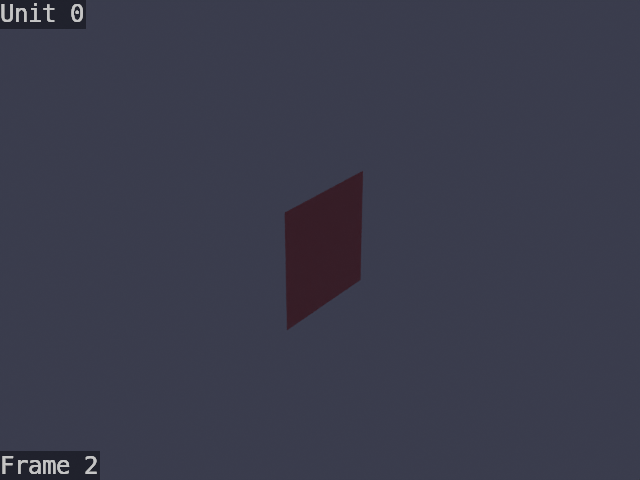
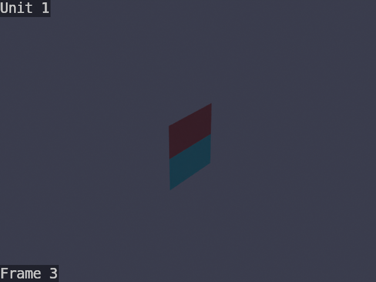
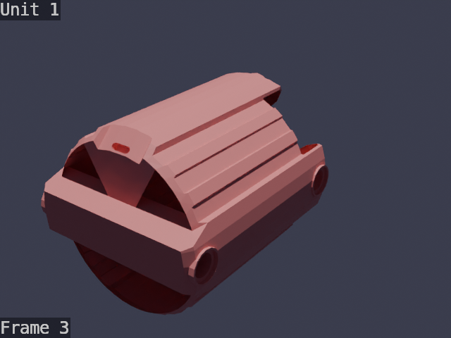
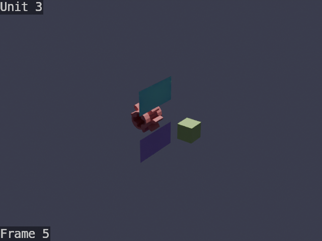
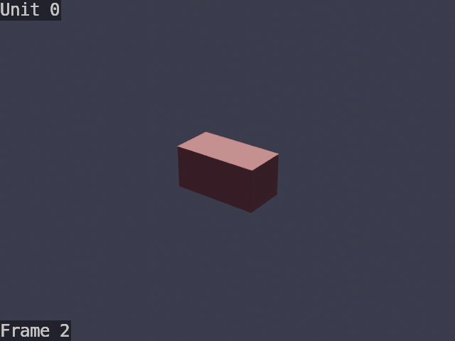
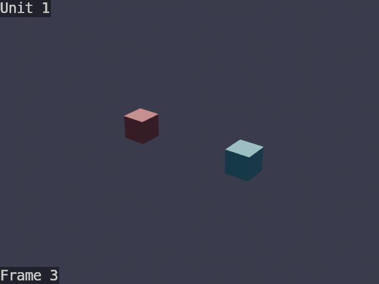

# Test Fixtures

LDraw `.ldr` files used as integration tests for the physics pipeline.
Each file is a minimal model that tests a specific connection or mechanism.

Run `./render_fixtures.sh` to regenerate the `.png` thumbnails (requires
Blender and `pip install -e .`).

## Fixture Descriptions

### friction_pin.ldr
Two Technic beams (32523) joined by a **friction pin** (4459).
- **Expected:** 1 rigid unit, 0 joints
- The friction pin locks both beams into a single rigid body.

### frictionless_pin.ldr
Two Technic beams (32523) joined by a **frictionless pin** (3673).
- **Expected:** 2 units, 1 revolute joint
- The frictionless pin allows rotation between the two beams.

### motor_gear.ldr
A motor (58121) driving an 8-tooth gear (3647) via an axle (3705).
- **Expected:** 2 units (motor, gear+axle), 1 revolute joint, 1 motor
- The motor's cross-shaped output creates a revolute (driven) joint.

### gear_mesh.ldr
An 8-tooth gear (3647) meshing with a 24-tooth gear (3648b) on parallel axles.
- **Expected:** 4 units, 1 gear mesh (ratio 0.333)
- Tests parallel spur gear mesh detection at correct center distance (40 LDU).

### pin_connection.ldr
Two cubes connected by a simulated single-point contact (legacy distance-based test).
- **Expected:** 1 unit (distance-based fallback)

### two_bricks_adjacent.ldr
Two cubes placed side by side with touching faces (legacy distance-based test).
- **Expected:** 1 unit

### two_bricks_separated.ldr
Two cubes placed far apart with no connection (legacy distance-based test).
- **Expected:** 2 units, 0 joints

